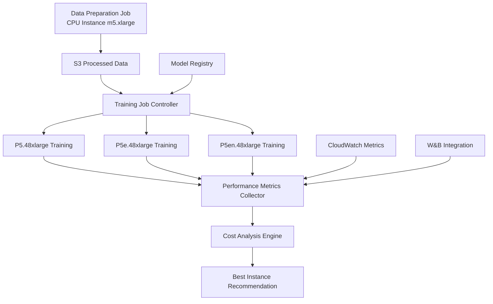

# SageMaker Migration Plan: P5 Instance Performance Comparison

## Overview
Migrate the Qwen Hebrew fine-tuning project to SageMaker with:
- **Training**: P5 instances (P5, P5e, P5en) for performance comparison
- **Data Preparation**: CPU instances (m5.large/m5.xlarge) for cost-effective preprocessing
- **Automated Performance Benchmarking**: Compare P5.48xlarge, P5e.48xlarge, and P5en.48xlarge

## Architecture Design



## Implementation Components

### Phase 1: Data Preparation Pipeline (CPU-based)
**Target Instance**: m5.xlarge (4 vCPU, 16 GB RAM)
- Cost-effective data preprocessing
- S3 data download and cleaning
- Dataset tokenization and formatting
- Upload processed data back to S3

### Phase 2: Training Infrastructure (GPU-based)
**Target Instances**:
- **P5.48xlarge**: 8x H100 80GB, 2 TB RAM, 8x 3200 Gbps network
- **P5e.48xlarge**: 8x H100 80GB, 2 TB RAM, 8x 3200 Gbps network, 8x 7.6TB NVMe SSD
- **P5en.48xlarge**: 8x H100 80GB, 2 TB RAM, 8x 3200 Gbps network + EFA

### Phase 3: Performance Comparison Framework
- Automated job submission across instance types
- Standardized metrics collection
- Cost-effectiveness analysis
- Training quality comparison

## Detailed Implementation Plan

### 1. SageMaker Training Scripts

#### 1.1 Data Preparation Script
**File**: `sagemaker/data_preparation.py`
- Runs on CPU instances
- Downloads Hebrew data from S3
- Processes and tokenizes data
- Uploads to S3 for training jobs

#### 1.2 Training Entry Point
**File**: `sagemaker/train.py`
- Adapted from existing `qwen_model/train.py`
- Instance-specific configurations
- SageMaker environment integration
- Distributed training setup

#### 1.3 Hyperparameter Tuning
**File**: `sagemaker/hp_tuning.py`
- Adapted from existing `qwen_model/hp_tuning.py`
- SageMaker Hyperparameter Tuning Jobs
- Instance-specific parameter ranges

### 2. Instance-Specific Configurations

#### 2.1 P4d.24xlarge Configuration
```json
{
  "instance_type": "ml.p4d.24xlarge",
  "gpu_count": 8,
  "gpu_memory": "40GB",
  "batch_size_per_gpu": 2,
  "gradient_accumulation_steps": 4,
  "deepspeed_config": "p4d_deepspeed_config.json"
}
```

#### 2.2 P4de.24xlarge Configuration
```json
{
  "instance_type": "ml.p4de.24xlarge",
  "gpu_count": 8,
  "gpu_memory": "80GB",
  "batch_size_per_gpu": 4,
  "gradient_accumulation_steps": 2,
  "deepspeed_config": "p4de_deepspeed_config.json",
  "use_nvme_cache": true
}
```

#### 2.3 P5.48xlarge Configuration
```json
{
  "instance_type": "ml.p5.48xlarge",
  "gpu_count": 8,
  "gpu_memory": "80GB",
  "batch_size_per_gpu": 6,
  "gradient_accumulation_steps": 1,
  "deepspeed_config": "p5_deepspeed_config.json"
}
```

### 3. Performance Benchmarking System

#### 3.1 Benchmark Runner
**File**: `sagemaker/benchmark_runner.py`
- Submits training jobs to all instance types
- Monitors job progress and metrics
- Collects performance data
- Generates comparison reports

#### 3.2 Metrics Collection
- **Training Speed**: Tokens/second, samples/second
- **GPU Utilization**: Memory usage, compute utilization
- **Cost Metrics**: Cost per epoch, cost per token
- **Quality Metrics**: Loss convergence, validation performance

#### 3.3 Cost Analysis
- Real-time cost tracking
- Performance-to-cost ratio calculations
- ROI analysis for each instance type
- Recommendations based on budget constraints

### 4. DeepSpeed Configurations

#### 4.1 P4d DeepSpeed Config
**File**: `sagemaker/configs/p4d_deepspeed_config.json`
- Optimized for A100 40GB
- ZeRO-3 with CPU offloading
- Memory-efficient settings

#### 4.2 P4de DeepSpeed Config
**File**: `sagemaker/configs/p4de_deepspeed_config.json`
- Optimized for A100 80GB
- ZeRO-2 (less CPU offloading)
- NVMe SSD utilization for checkpointing

#### 4.3 P5 DeepSpeed Config
**File**: `sagemaker/configs/p5_deepspeed_config.json`
- Optimized for H100 80GB
- ZeRO-2 with minimal offloading
- Maximum performance settings

### 5. SageMaker Job Definitions

#### 5.1 Data Preparation Job
```python
data_prep_job = {
    "job_name": "hebrew-data-preparation",
    "instance_type": "ml.m5.xlarge",
    "instance_count": 1,
    "max_runtime_in_seconds": 3600,
    "input_data_config": [
        {
            "channel_name": "raw-data",
            "data_source": {"s3_data_source": {"s3_uri": "s3://your-bucket/raw-data/"}}
        }
    ],
    "output_data_config": {"s3_output_path": "s3://your-bucket/processed-data/"}
}
```

#### 5.2 Training Job Template
```python
training_job_template = {
    "job_name_prefix": "qwen-hebrew-training",
    "algorithm_specification": {
        "training_image": "your-ecr-repo/qwen-training:latest",
        "training_input_mode": "File"
    },
    "input_data_config": [
        {
            "channel_name": "training",
            "data_source": {"s3_data_source": {"s3_uri": "s3://your-bucket/processed-data/"}}
        }
    ],
    "output_data_config": {"s3_output_path": "s3://your-bucket/models/"},
    "resource_config": {
        "instance_count": 1,
        "volume_size_in_gb": 500
    },
    "stopping_condition": {"max_runtime_in_seconds": 86400}
}
```

## Expected Performance Comparison Results

### P4d.24xlarge (A100 40GB)
- **Pros**: Good balance of performance and cost
- **Cons**: Limited GPU memory may require smaller batch sizes
- **Expected Use Case**: Medium-scale training with budget constraints

### P4de.24xlarge (A100 80GB + NVMe)
- **Pros**: Double GPU memory, fast local storage
- **Cons**: Higher cost than P4d
- **Expected Use Case**: Large batch training with checkpointing optimization

### P5.48xlarge (H100 80GB)
- **Pros**: Latest GPU architecture, highest performance
- **Cons**: Highest cost, limited availability
- **Expected Use Case**: Maximum performance training, time-critical projects

## Cost Estimation Framework

### Hourly Rates (approximate)
- **P4d.24xlarge**: ~$32/hour
- **P4de.24xlarge**: ~$40/hour  
- **P5.48xlarge**: ~$98/hour

### Performance Metrics to Track
1. **Training Throughput**: Tokens processed per hour
2. **Cost Efficiency**: Cost per million tokens processed
3. **Time to Convergence**: Hours to reach target loss
4. **Total Training Cost**: Complete training cost per instance type

## Implementation Timeline

### Week 1: Infrastructure Setup
- [ ] Create SageMaker training containers
- [ ] Adapt training scripts for SageMaker
- [ ] Set up S3 data pipeline
- [ ] Create instance-specific configurations

### Week 2: Data Preparation Pipeline
- [ ] Implement CPU-based data preprocessing
- [ ] Test data preparation on m5.xlarge
- [ ] Optimize S3 upload/download performance
- [ ] Validate processed data format

### Week 3: Training Pipeline Development
- [ ] Implement P4d training configuration
- [ ] Implement P4de training configuration  
- [ ] Implement P5 training configuration
- [ ] Test training jobs on each instance type

### Week 4: Performance Benchmarking
- [ ] Run standardized training jobs
- [ ] Collect performance metrics
- [ ] Analyze cost-effectiveness
- [ ] Generate recommendations

## Success Criteria

1. **Successful Migration**: All training components work on SageMaker
2. **Performance Data**: Complete metrics for P4d, P4de, and P5 instances
3. **Cost Analysis**: Clear cost-benefit analysis for each instance type
4. **Recommendations**: Data-driven recommendation for optimal instance type
5. **Scalability**: Easy scaling and configuration for future training jobs

## Next Steps

1. **Approve Plan**: Review and approve this migration plan
2. **Begin Implementation**: Start with SageMaker infrastructure setup
3. **Iterative Development**: Implement components incrementally
4. **Testing and Validation**: Validate each component before moving to next phase
5. **Performance Analysis**: Run comprehensive benchmarks and analysis