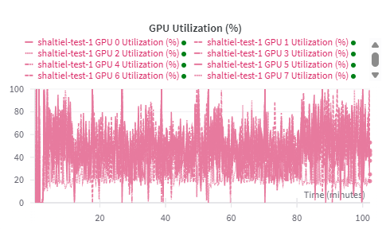

# Training Qwen3-30B-A3B 

A working reproduction of single-node distributed continuous-pretraining of a MoE model, using HF Accelerate + DeepSpeed, with no CPU-offloading. 

## Setup

### AWS Details

This code was proven to work with the following settings - it may work in other settings as well. 

Machine Type: `p4de.24xlarge`

AMI: `Deep Learning OSS Nvidia Driver AMI GPU PyTorch 2.7 (Ubuntu 22.04)`

### Environment

The following code only needs to run *once* per machine (for resuming, see below)

```bash
# Clone & Locate
git clone -b shaltiel_training https://github.com/sarelWeinberger/qwen-hebrew-finetuning
cd qwen-hebrew-finetuning/qwen_model_shaltiel

# Install uv
curl -LsSf https://astral.sh/uv/install.sh | sh
source $HOME/.local/bin/env

# Create a new virtual environment
uv venv
source .venv/bin/activate

# Install libraries
uv pip install -r requirements.txt
# To install other libraries, run `uv pip install new_library`

# Download model
export HF_HUB_ENABLE_HF_TRANSFER=1
hf download Qwen/Qwen3-30B-A3B-Base

# Login to services
wandb login
# hf login - this will be needed when we want to push models to the hub
```

When logging back into a machine after a stop, jus tactivate the venv again:

```bash
source .venv/bin/activate
```

### Data

Right now the script default to a sample of wikipedia data located in the current directory - [here](./he_wiki_sample.jsonl). 

The format is a JSON-Lines file where each line contains an object with a `text` field:

```json
{"text": "text of document one"}
{"text": "text of document two"}
...
```

## Training

### Configuration

The script by default reads in the file [cpt_config.json](./cpt_config.json) for the configuration, but you can specify any other JSON file. 

These are the parameters (currently) supported:

- `model_name_or_path`: (*Required*) - The path to the model we want to train. For the first phase of training it should be `Qwen/Qwen3-30B-A3B-Base`, and for the next phases we want to point it to the intermediate models (e.g., long context)

- `max_seq_length`: (*Required*) - The maximum sequence length to train on - e.g., 512, 2048, 4096, etc. 

- `per_device_train_batch_size`: (*Required*) - The per-GPU batch size to run (also known as micro batch-size).

- `gradient_accumulation_steps`: (*Required*) - The number of gradient accumulation steps. This is the number of steps to compute gradients for before performing an update to the parameters. 

    > **IMPORTANT**: The value here *must* match the value in the deepspeed config passed into the script. The instructions here use the file [deepspeed_zero3.yaml](./deepspeed_zero3.yaml). 

- `output_dir`: (*Optional*, defaults to `./output`) - The directory to save all the intermediate checkpoints

- `learning_rate`: (*Optional*, defaults to `1e-5`) - The (max) learning rate to use for training. 

- `logging_steps`: (*Optional*, defaults to `10`) - Log the results to wandb every N steps. 

- `num_train_epochs` (*Optional*, defaults to `1`) - The number of epochs to run on the data. Ignored if `max_steps` is provided. 

- `max_steps` (*Optional*, defaults to `None`) - The number of training steps to run on the data. If this is set, it overrides the `num_train_epochs` field. 

- `save_steps` (*Optional*, defaults to `500`) - Save a checkpoint of the model every N steps. 

- `save_total_limit` (*Optional*, defaults to `5`) - The maximum number of checkpoints to save to disk before deleting old ones. 

- `warmup_ratio` (*Optional*, defaults to `None`) - What percent of the training should be used for LR warmup. E.g., `0.1` means warmup should be 10% of the train. If this is set, it overrides the `warmup_steps` field. 

- `warmup_steps` (*Optional*, defaults to `100`) - The number of LR warmup steps.  Ignored if `warmup_ratio` is provided. 

### DeepSpeed

The script uses `DeepSpeed` to accelerate training, the default configuration used here can be found in [deepspeed_zero3.yaml](./deepspeed_zero3.yaml). 

The only important to note here is that the `gradient_accumulation_steps` **must** be set to the same value specified in the JSON configuration. 

### Running! 

First of all, make sure you are in the virtual environment, and if not, run:

```bash
cd qwen-hebrew-finetuning/qwen_model_shaltiel/
source .venv/bin/activate
```

And finally:

```bash
nohup accelerate launch --config_file=deepspeed_zero3.yaml train.py --wandb_name run-name-for-wandb > training_output.log 2>&1 &```

Other parameters to set:

- `--config /path/to/alternative/config.json` (Path to an alternative [Configuration](#configuration))
- `--dataset_path /path/to/data/jsonl` (Path to alternative [Data](#data))
- `--seed 111` (Specifying a different random seed)
- `--wandb_project a_different_wandb_project` (For separating runs into a different WandB project)

## Next Steps

We have a working script here that trains, utilizes all GPUs with DeepSpeed+Zero3, and the output loss is reasonable (aka, correct tokenization)

That being said, there are still many improvements that must be done to the script for large-scale training:

- **Packing**: In order to maximize utilization we want to avoid padding, and instead we pack sequences together. See [here](https://lweitkamp.github.io/posts/packing/index.html) for more details. This is crucial for successfully training the LLM. 

- **Large Dataset**: The current script assumes a small sample, and loads the full dataset into memory tokenizing ahead of time. When working with very large datasets, we can't have them all in memory at once - instead we want to pre-tokenize and stream them to avoid any bottlenecks. 

- **GPU Utilization**: Right now we have a reasonable GPU utilization, average at ~60%. That's decent, but we want to be nearing 99%. This can definitely improve with hardware, but there are software changes that should be done. 


- **Hyperparameter Tuning**: We want to optimize the hyperparameters we're using - currently there is no support for `optuna`, that needs to be added. 

- **Checkpoint Uploading**: When ready, we should open up an organization in HuggingFace where the checkpoints will be uploaded to as the model trains. This allows us to test them out, evlauate them, etc. This requires both setting up an organization, and also configuring the `push_to_hub` option in the script. 

- **Evaluation**: There are two types of evaluation that still need to be done:

    1. Perplexity - this can be done within the `train.py` script, we just need to update the script accordingly and set `eval_dataset` to the relevant dataset. 

    2. Quality - this will involve pulling the checkpoints from the hub as they're uploaded, and then evaluting them using a library like `lighteval`. 
